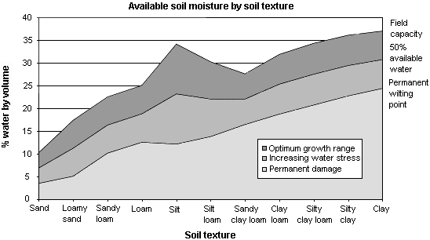

# Technology

## Smart Irrigation System
In the system, we will have 2 types of computations. Locally we will have a logic to decide when we want to activate the relay (it will be connected to a water pump) using the values received by sensors. In the Cloud, we want to add the possibility to show historical data or to perform analyses of statistics. 
The user can monitor the system state and can visualize the statistics provided from the cloud. Every time there will be shown the most recent sent values of the air temperature and soil moisture level of the ground around the palace where the plants are located.

## LoRaWAN board
The module is powered by an STM32L072CZ micro-controller that incorporates the connectivity power of the universal serial bus (USB 2.0 crystal-less) with the high-performance Arm Cortex-M0+ 32-bit RISC core operating at a 32 MHz frequency and SX1276 transceiver that features the LoRa long-range modem, providing ultra-long-range spread-spectrum communication and high interference immunity, minimizing current consumption.
We changed the decision to use Wifi Module (ESP-01S ESP8266) since it has a higher power consumption. It consumes 70.89 mA if the node is on active mode and 0.25 mA when the sleep mode is activated. Instead, the SX1276 transceiver consumes around 10 mA during the active mode. 
To communicate with TTN(The Things Network) we will use the LoRa module as a communication protocol. Afterwards, we will integrate the TTN with AWS IoT Core in order to receive messages in the Broker on AWS. Some parameters must be set up before communicating: dev_eui, app_eui, app_key. 

## Why LoRaWAN 
LoRaWAN =  Long Range Wide Area Network

Since an IoT device needs to communicate with the internet, we need to have a standard of communication. 
From the laws of physics we know that there are 3 main parameters that characterize the transmitters : 
    - Covered area
    - Power consumption
    - Bandwidth

Since we want a device to communicate in wide areas, we want a technology that creates radio signals for long distances. In order to achieve that we can either increase the power consumption or reduce the bandwidth.

Increasing the power consumption for communication is a very bad solution for our system since we are going to use batteries to feed the system and this way it would last some days. 
Reducing the bandwidth would also reduce the capacity of our communication channel. However this would not be a problem since our system will send messages only a few times a day because it measures the variance of 2 parameters that doesn't change very frequently.

LoRaWAN is the best choice for our system because it satisfies all points we mentioned before. 
It also comes with a link budget equal to 154dB.
Using a radio link budget calculator [click](https://en.jirous.com/calculation-wifi), we calculate that in perfect conditions it can reach up to 1300 km of  distance. 

## DHT22 temperature and humidity sensor
DHT22 temperature and humidity sensor is used to measure air temperature and humidity in order to provide, according to the weather conditions, the right amount of water necessary for the plant’s growth. It will also impact the sampling frequency of the soil moisture sensor since it is not necessary to check the humidity level very often during cold periods, improving this way the life of the battery. The sensor will measure every 2 hours because the variance of the temperature is on average 2 Celsius degrees/hours (ref:https://en.wikipedia.org/wiki/Diurnal_air_temperature_variation) so by measuring every 2 hours we can maintain the environmental conditions under control.

    • Model DHT22 
    • Power supply 3.3-6V DC 
    • Output signal digital signal via single-bus 
    • Sensing element Polymer capacitor 
    • Operating range: humidity 0-100%RH / temperature -40~80 Celsius 
    • Accuracy humidity +-2%RH(Max +-5%RH); / temperature <+-0.5 Celsius
    • Resolution : humidity 0.1%RH / temperature 0.1 Celsius 
    • Repeatability humidity +-1%RH / temperature +-0.2 Celsius 
    • Sensing period Average: 2s 
    • Dimensions small size 14*18*5.5mm; big size 22*28*5mm 
    

## Adafruit Seesaw Soil moisture sensor
A soil moisture sensor is used to measure the soil moisture in order to provide, according to the soil conditions, the right amount of water necessary for the plant’s growth when needed.

    • Operating voltage: 3.3 ~ 5.5 VDC
    • Output voltage: 0 ~ 3.0 VDC
    • Operating Current: 5mA 
    • Interface: PH2.54-3P
    • Dimensions: 98 x 23 mm (WxW)
    • Weight 15g
    • Pin: analog signal output, GND, VCC

    

As we mentioned before, the sampling rate will be variable and will depend on the temperature we are measuring by the dht22 sensor. 
Since on average the plants need to be irrigated twice a day, we will sample with double that frequency. So the sampling period will be 6 hours. However there might be periods of time that the temperature will be lower than normal, so the check over the humidity level must be less frequent(half of the original), so the sampling period will be 12 hours. The reason for this choice is to reduce by50% the duty cycle.
To sum up, we have two situations:
Cold days: sampling period = 12 hours
Hot days: sampling period = 6 hours

## TFT ILI9341 LCD display
This display allows you to show the soil and weather conditions provided by sensors. In order to have an efficient system, we will use the power saving modes of the display.

    •Display resolution: 240 x 320 (RGB)
    •Output: 720 source outputs
        320 gate outputs  
        Common electrode output (VCOM)  a-TFT LCD driver with on-chip full display
        RAM: 172,800 bytes
    •Display mode:
    •Full-color mode (Idle mode OFF): 262K-color 
    •Reduced color mode (Idle mode ON): 8-color
    •Power saving modes: 
    •Sleep mode 
    •Deep standby mode
    •Content Adaptive Brightness Control
    •Low-power consumption architecture
    •Operate temperature range: -40℃ to 85℃

## 1 Channel relay module
A channel relay module is used to trigger the water pump.
 

    • Supply Voltage	3.75 to 6 V
    • Supply Current	70 mA
    • Input Control Signal	Active Low
    • Input Control Signal Current	1.5 to 1.9 mA
    • Relay Max Contact Voltage	250 VAC or 30 VDC
    • Relay Max Contact Current	10 A
    • Dimensions
        Length	43 mm (1.69")
        Width	17.5 mm (0.69")
        Height	17 mm (0.67")
        Weight	13 g (0.459 oz)

## Water pump
The water pump is activated according to the values provided by sensors. Trigger by relay module, the water pump will take the right water amount to irrigate the plants. From the datasheet of the pump, we see that it irrigates from 20-25 ml/second. 

    • Operating Voltage: 3-5 V
    • Operating Current: 100 - 200 mA
    • Water Inlet Entrance Dimension: 5.0 mm
    • Water Outlet Exit Outer Diameter: 7.5 mm
    • Water Outlet Exit Inner Diameter: 4.5 mm
    • Head Distance: 0.3 - 0.8 meter
    • Flow Rate: 1.2 - 1.6 Liter per minute
    • Weight: 28g   
    

On this chart we can see different level of humidity the plants must have to have an optimal growth. So the quantity of water we have to irrigate depends on:
    - the type of the plant
    - the plant growth
    - the soil texture it is located

However for the sake of simplicity and in order to test the system functionalities, we consider an irrigation time equal to 5 seconds. 

  ## Logic explanation
The logic we use on the board starts by calling the main function, in which we initialize once all the components including sensors, actuators and Lora connection. After that, we create 2 threads, one for each sensor. The sensors will sample with different sampling periods as explained before. The thread used to measure the temperature will be active during the read, it will change the environment’s state if needed and will update the values on display and will send messages to the cloud. It will be on sleep for 2hours(to test the system we make it sleep for 20 seconds). 
The other thread will be active for reading the moisture level, updating the display values and sending messages to the cloud. On this thread, we will check whether we need to irrigate the plant or noy. If the irrigation is needed, we switch on the relay and activate the water pump for 5 seconds(only for experimental purposes). It will be sleeping for 6 or 12 hours depending on the temperature. 

## The accuracy 

###  Water Pump
To check how many ml of water the pump irrigates we consider a container for the water. Since we can maintain a counter of how many irrigations we make during a certain period, we check how many litres we have used to irrigate during a week. 
So for example, if the system irrigates 10 times a week for 5 seconds of irrigation each time, we have 50 seconds of irrigation a week.
We measure the used amount of water on the container (1300 ml for example) and find how many ml/second the pump has irrigated: 
1300/50 = 26 ml
This is how we are going to measure the accuracy of the irrigation compared to the documentation values.

### DHT22 and Adafruit Seesaw soil moisture sensors
Since testing the system with real sampling rates would take a lot of time, we consider the sampling rate in terms of seconds. The way we are going to observe some eventual anomalies is by reading values for a short amount of time (1 minute) in different periods of the day(morning, noon, evening, night). 

    
    
    
