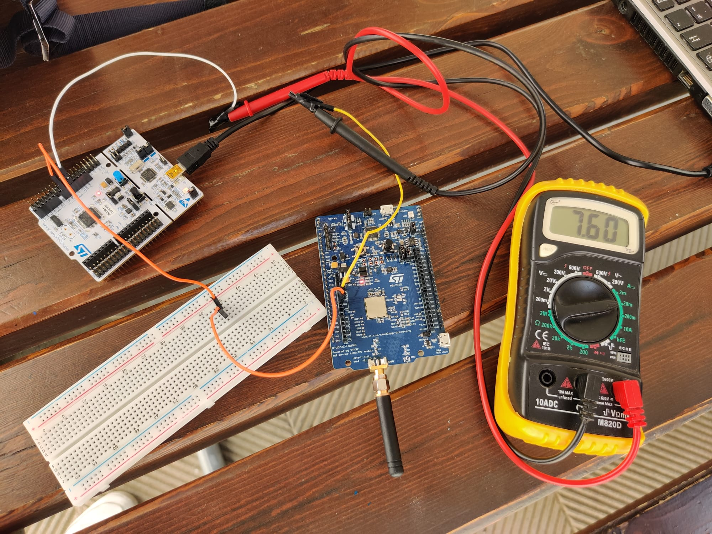
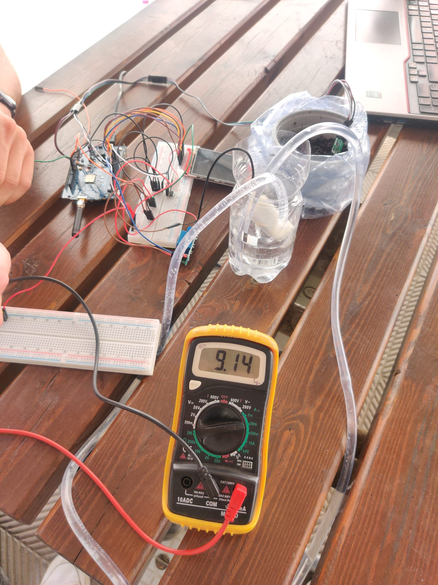
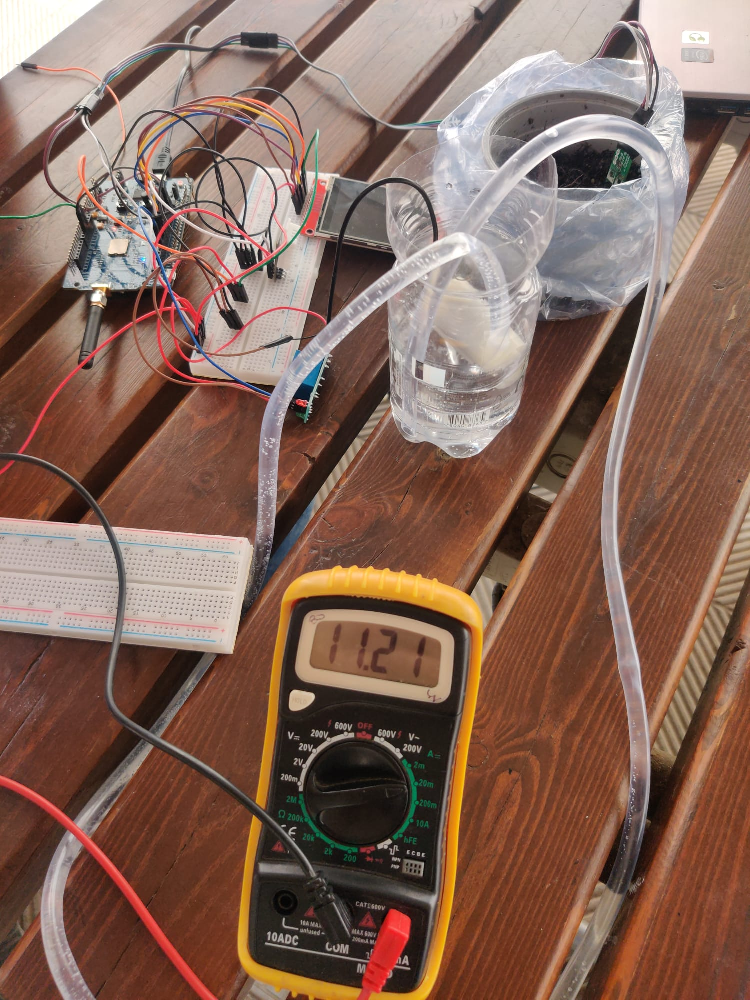
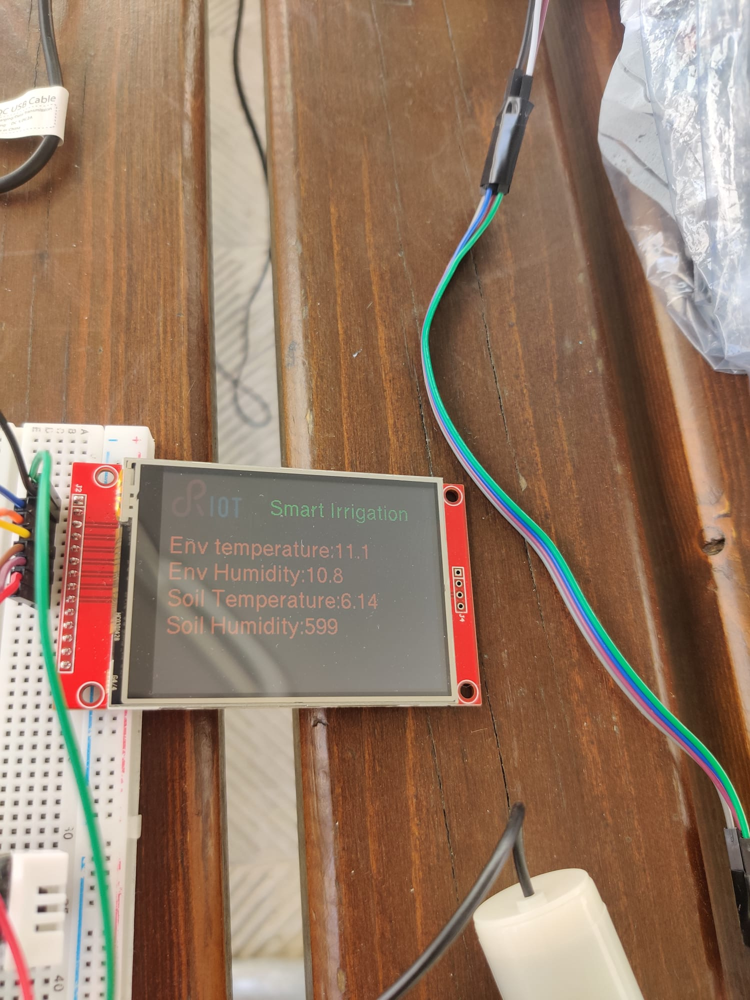

# Evaluation
 
## Energy Consumption
Energy consumption is one of the main constraints of the system in terms of evaluation. This system is powered by 3 batteries with a total amount of 3750mAh. Alternatives of this solution could be using solar energy or rechargeable batteries. However, the solar panels would be costly so it is not respecting the constraints we have on the terms of production cost. Also, the rechargeable batteries cannot be used since the system is thought to be used also in gardens where it will not be possible to charge it continuously.

We will activate the components:
- Display: The value will be updated after every measurement and it will remain active on some small intervals of time. More precisely it will be activated for 1 second every 1 minute.
- Relay: Tt will be activated only when irrigation is needed. The assumption we make is that the relay will be active only for 10 seconds per day since we do on average 2 irrigation per day with 5 seconds each.
- Sensors: Dht22 sensor will read the temperature values with a sampling period of 2 hours. On the other hand, the Seesaw soil moisture sensor will have a variable sampling period (6/12 hours). To have a prove that the irrigation is done correctly, we will also have a measurement of soil humidity around 15 minutes after each irrigation.
 
 
## Analysis on sampling frequency (Battery lifetime)
Here we will represent the power consumption the components need when they are on active mode:
dht22 = 1,5 mA
seesaw adafruit = 5 mA
relay = 135 mA
TFT ILI9341 LCD display = 30 mA

**Battery lifetime = Capacity / Current Intensity**
 

Notice that we are only considering the power consumption of the components without the power related to the communication.

###### first approach

The first approach we considered was the one in which the sensors continuously sample, the relay pump is activated only twice a day(for irrigation purpose only) and the display is always on.

Component _name | mA | duty_cycle 
--- | --- | --- 
Dht22 | 1,5 | 100% 
Seesaw | 5 | 100% 
ILI9341 | 30 | 100% 
relay | 135 | ~ 0.001% 

Total: 1,5* 1 + 5* 1 + 30* 1 + 135* 0.000001 ≈ 36,5 mA.
With the battery of 3750 mA, our system would last: 3750 mAh / 36,5mA ≈ 103 hours ( something more than 4 days). This is a very bad result since it doesn't satisfy the requirement to last at least one year. However, it will not be necessary to continuously sample since the variation of the air temperature and soil moisture is not very high.
 
###### second approach
One second approach is that we sample with the dht22 sensor 1 time every 2 hours and with the humidity sensor once in 6 hours with 2 seconds active for every time we measure. The relay is activated as we said before only 2 times in a day for 5 seconds each time and the display is always active.
 
Component _name | mA | duty_cycle 
--- | --- | --- 
Dht22 | 1,5 | ~ 0.030% 
Seesaw | 5 | ~ 0.013% 
ILI9341 | 30 | 100% 
relay | 135 | ~ 0.001% 

Total = 1,5* 0,0003 + 5* 0,00013 + 30* 1 + 135* 0,00001 ≈ 30,005 mA.
With the battery of 3750 mA our system would last: 3750 mAh / 30,005 mA ≈ 125 hours (5 days)
Still we do not have good result. Notice that the major part of the consumption comes from the display which has always been active. By trying to reduce the active time od the display we for sure will have better results.

###### third approach
The approach that we are actually considering is to sample with the dht22 sensor 1 time every 2 hours and with the humidity sensor once in 6 hours with 2 seconds active for every time we measure. The relay is activated as we said before only 2 times in a day for 5 seconds each time but now the display will be active for only 1 second every minute. We choose 1 second since it is reasonable to have a good monitoring but also considering the battery life improvement.

Component _name | mA | duty_cycle 
--- | --- | --- 
Dht22 | 1,5 | ~ 0.030% 
Seesaw | 5 | ~ 0.013% 
ILI9341 | 30 | ~ 1,6% 
relay | 135 | ~ 0.001% 

Total = 1,5* 0,0003 + 5* 0,00009 + 30* 0,016 + 135* 0,000001 ≈ 0,505 mA.
With the battery of 3750 mA our system would last: 3750 mAh / 0,505 mA ≈ 7425 hours ( around 309 days)
This approach meets the requirement of making the battery last for almost 1 year.

###### actual measures using amper meter
The power consumption of the board only is 7.6 mA. 

During the ctive time of all sensors and actuators we have a consumption of 9.14 mA. 

The system makes one join request every time it is active and uses the radio to send messages. The time needed to do these operations is around 5 seconds. The consumption of the overall system for this period is 11.21 mA. 

The moment when we are spending more is when we irrigate the water. The time of irrigation depends on how the weather and soil conditions are. During this period, the system uses 147 mA.

**What can we do better?**
We have noticed that the component that consumes the most is the display. So it is taken under consideration to use another type(with less power consumption) in order to reduce it consumption up to 50%.
Also changing the frequency of showing the values or implementing a technique of reading the values from the display only when it is requested, would bring us a less consume of battery. 

## Messages structure
As we said before, there will be 3 types of messages we will send to the cloud.
All of them will have the same length of 6 bytes : [type{1}}data{4}]
 
Temperature type message :
- xxx = value of the most recent temperature read
- payload = Txxx
 
Soil moisture type message :
- xxx = values of the most recent soil moisture read
- payload = Mxxx
 
Irrigation type message :
- xxx = irrigation time
- payload = Ixxx
 
 
## Analysis on radio usage
To transmit the messages to the cloud we can choose to do it in 2 different ways:
1. Transmit after every time we read a value with the corresponding values and every time we irrigate with responding time of irrigation. In total, during a single day, we will send 12 messages with the temperature value, at least 4 messages with humidity value + 2 messages after each irrigation and 2 messages with irrigation time value.
The total time the radio will remain active is:
TOTAL = 20 * Twut(Wake Up Transceiver) + 20 * Ttr (Transmission Data)
 
2. Transmit only once a day. This way we will need memory to store the messages but we would reduce the frequency of waking up the transceiver. So the total time the radio will remain active is:
TOTAL = 1 * Twut + 20 * Ttr
 
The choice we consider is the one to use the first transmission method. Even though we might reduce the battery consumption and make it last more with the second method, it is not good since we would have the data updated once a day losing the possibility to monitor the system and act on it if needed.

From measurements done with the amper meter, the time needed to do the join procedure and to send messages is around 5 seconds. 
 
## Network Usage
Using the LoRa protocol for communication we are able to connect to gateways found very far (till 15 km far) from where the system is located which goes along with the constraint of implementing the system within a couple of km close to the nearest gateway.
 
Even though this module has a small data  transmission bandwidth (50 kb/s), we do not have any problem with that since the length of the payload is always less than 5 bytes.
 
We will use IoT_Lab for 2 scopes. The first one is to test the system by creating a simulated environment. The other scope is the one to analyze a larger scale of the nodes.
 
